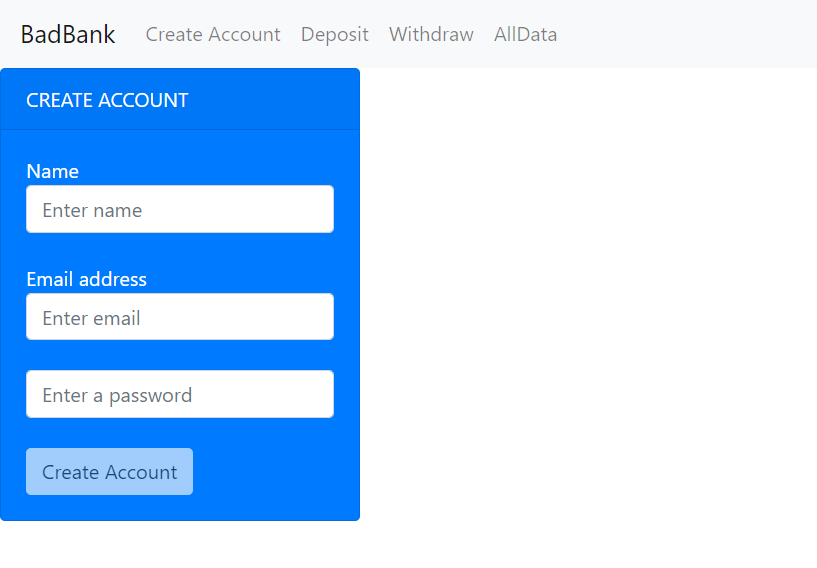

# Bad-Bank
## Bad Bank Project

This bad bank is so named because it does not have security (no login or logout). It does, however, contain a page with an input field whereby someone can enter a name, email, and password. A list of names, emails, and passwords is collected and displayed on the All Data page, which is a table within a Bootstrap card. There is a deposit page and a withdraw page as well, with balance that is updated as amounts are entered. Error messages keep the user on the right track as far as what and how much can be deposited and withdrawn. This project was created using React.  
To run this on your machine, download the files and start an http-server from your terminal or from VSCode (or Liveserver from VS Code). A video walkthrough of the project can be found at https://www.canva.com/design/DAFvmdZhHsU/Sbfix1bvwHTcm6z3u54j5g/watch?utm_content=DAFvmdZhHsU&utm_campaign=designshare&utm_medium=link&utm_source=publishsharelink.   
Additional functionality that would be helpful to a user for future iterations would be to merge the balances of the deposit and withdraw pages and to include secure login and log out.  
MIT License  
Copyright (c) 2023 Yvette Watson  
Permission is hereby granted, free of charge, to any person obtaining a copy of this software and associated documentation files (the "Software"), to deal in the Software without restriction, including without limitation the rights to use, copy, modify, merge, publish, distribute, sublicense, and/or sell copies of the Software, and to permit persons to whom the Software is furnished to do so, subject to the following conditions:
The above copyright notice and this permission notice shall be included in all copies or substantial portions of the Software.  
THE SOFTWARE IS PROVIDED "AS IS", WITHOUT WARRANTY OF ANY KIND, EXPRESS OR IMPLIED, INCLUDING BUT NOT LIMITED TO THE WARRANTIES OF MERCHANTABILITY, FITNESS FOR A PARTICULAR PURPOSE AND NONINFRINGEMENT. IN NO EVENT SHALL THE AUTHORS OR COPYRIGHT HOLDERS BE LIABLE FOR ANY CLAIM, DAMAGES OR OTHER LIABILITY, WHETHER IN AN ACTION OF CONTRACT, TORT OR OTHERWISE, ARISING FROM, OUT OF OR IN CONNECTION WITH THE SOFTWARE OR THE USE OR OTHER DEALINGS IN THE SOFTWARE.
